# Vue install
```
npm install
```
```
npm axios
```
```
npm install bootstrap-vue-3
```

# Django
``` 
pip install -r requirements.txt
```

# 색 정보
```
#ea3e54
```

# 진행상황
## 11/26
```
1. 프로필 사진 수정 기능 추가
2. 초기화면 수정 완료
3. 홈 페이지 캐러셀 하나 더 추가함. -> 기존: 배너+무비차트. 추가: 최신영화
```
## 11/25
```
1. 유저 정보 관련(마이페이지, 유저정보 수정) 페이지 css 수정 완료
2. AI 기능 추가 -> 영화에 나온 장소 AI에게 물어보면 google map API를 통해 해당 장소 좌표 찍어줌
3. 좋아요 css 수정 완료
4. 초기화면 세팅함 -> 회원가입으로 넘어가게 설정
5. 유저 프로필 사진 설정
```
## 11/24
```
1. 커뮤니티 상세 페이지 디테일 추가
1-1. 게시글 넓이 줄이기
1-2. 글쓰기 수정 삭제 버튼 추가 및 맨 밑으로 정렬
1. 홈페이지 예고편 배너 꽉 차게 변경
2. 캐러셀 뒤에 그림자 제거함
3. 전체적으로 색상 맞추기
4. 커뮤니티 수정 중 - 파일 -> 완료
5. 게시글 검색 기능 - 전체게시글 뷰에만 포함해둠. 검색기능은 아직안됨

6. 마이페이지 구현
7-1. 마이페이지 수정하는 부분은 조금 더 손봐야함
7-2. 새로고침 없이도 로그인한 사용자 마이페이지로 이동가능

1. AI 기능
8-1. 가능한지는 모르겠음 일단 페이지는 만들어놓음 API Key 문제같음
```
## 11/22
```
1. 홈페이지 배너 자동재생 및 커서 갖다대도 조작할 수 없게함
2. 로그인/회원가입 css 적용완료
3. 로고 변경함
4. 전체적으로 검색 창/폼 css 적용함 

5. 새로고침 없이 게시글 수정/삭제 잘 됨
```
## 11/21
```
1. 로그인/로그아웃/회원가입/게시글 생성 정상작동 -> logOut함수에 추가한 부분

# 클라이언트 상태 초기화
token.value = null;
localStorage.removeItem("token"); // localStorage에서 토큰 삭제
alert("로그아웃 되었습니다.");
router.push({ name: "LogInView" }); // 로그아웃 후 로그인 페이지로 이동
} catch (err) {
console.error("로그아웃 요청 실패:", err);

// 401 에러 처리: 만료된 토큰 제거
if (err.response?.status === 401) {
  alert("인증 정보가 유효하지 않습니다. 다시 로그인하세요.");
  token.value = null;
  localStorage.removeItem("token");
  router.push({ name: "LogInView" });
} else {
  alert("로그아웃에 실패했습니다. 다시 시도해주세요.");
}

2. 유튜브 api 연결
2-1. 무비 차트 1위의 공식 예고편을 배너로 설정
2-2. 영화 상세 페이지로 들어가면 해당 영화의 공식 예고편 새로고침 없이 바로 재생 가능
2-3. 무비 장르별/ 무비 차트별 페이지 구현 완료
2-4. 글씨체 등의 css 적용완료 (영화 페이지만)
2-7. 게시글 상세 페이지 css 수정 완료
2-8. 커뮤니티 상세 페이지 css 수정 중

3. 커뮤니티 
3-1. 댓글 기능(생성/삭제) 완료.
3-2. 회원가입 navbar 수정 완료
3-3. 커뮤니티 게시글 수정 및 삭제기능 반씩만 됨 
    수정페이지로 로딩하는 거랑 삭제후 게시글 페이지로 로드하는 것만 하면 됨
```
## 11/20
```
1. 로그인/로그아웃/회원가입 정상작동 -> 다시 오류남
2. 영화 장르 페이지 구현 - 장르선택은 하는 중
```

# 실행 결과
## ERD
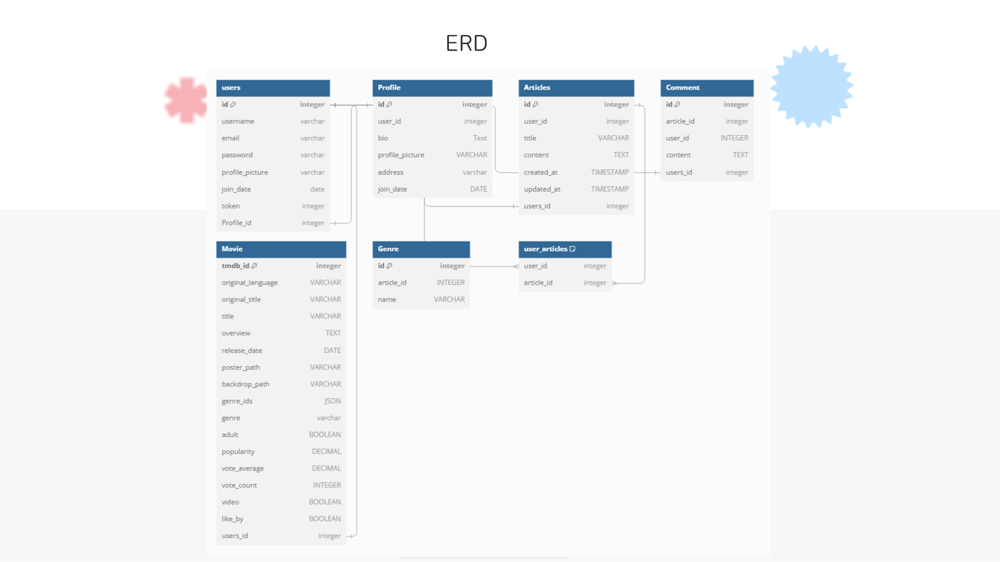
## 기술 구성
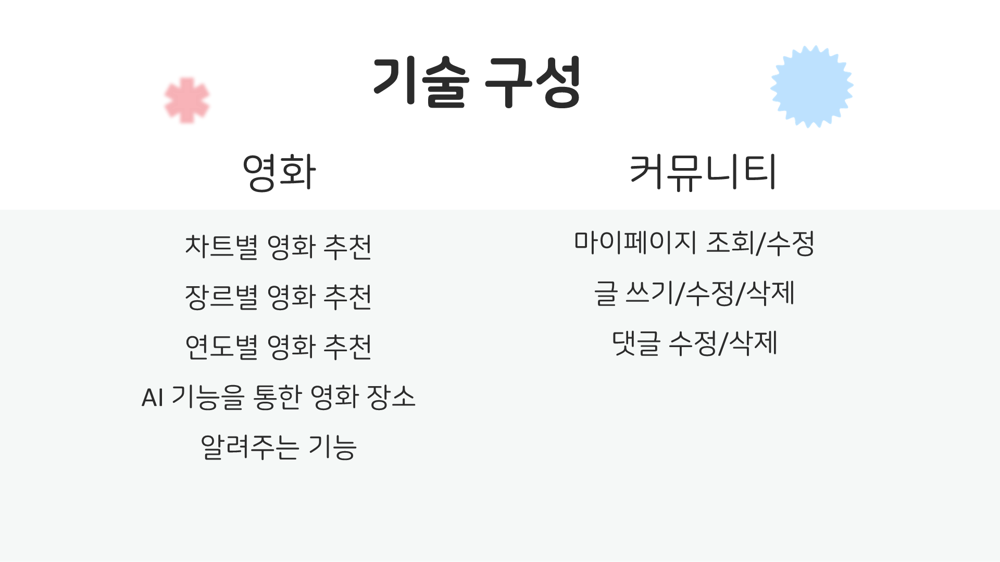
## 홈페이지
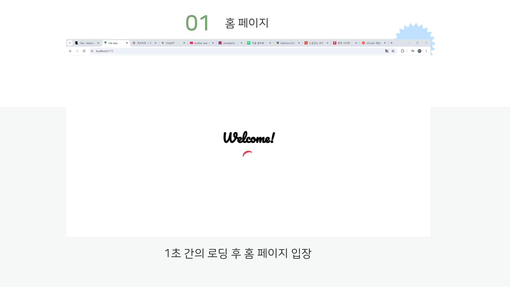
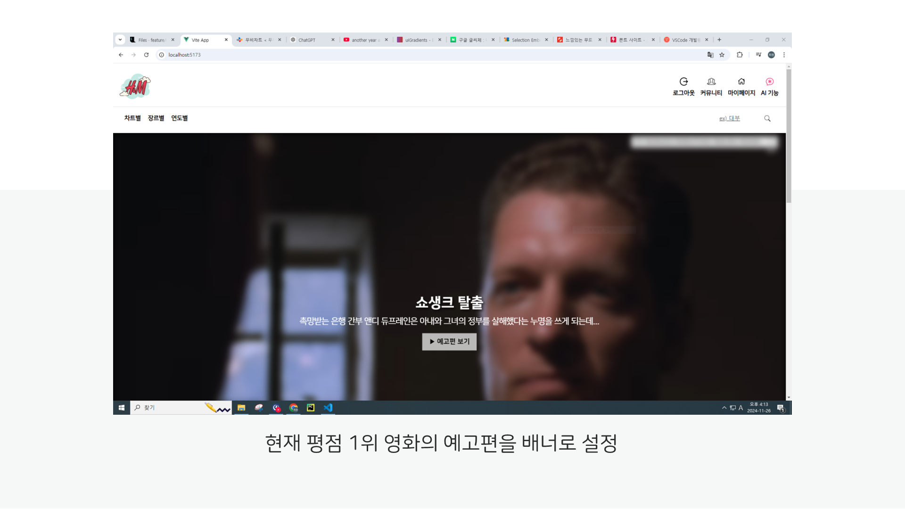
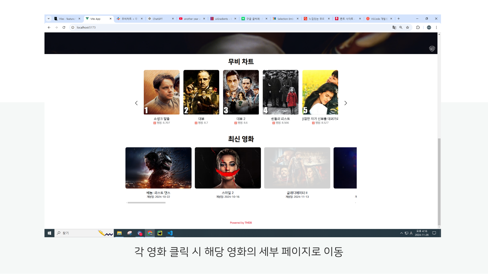
## 영화 추천
### 평점 순위별
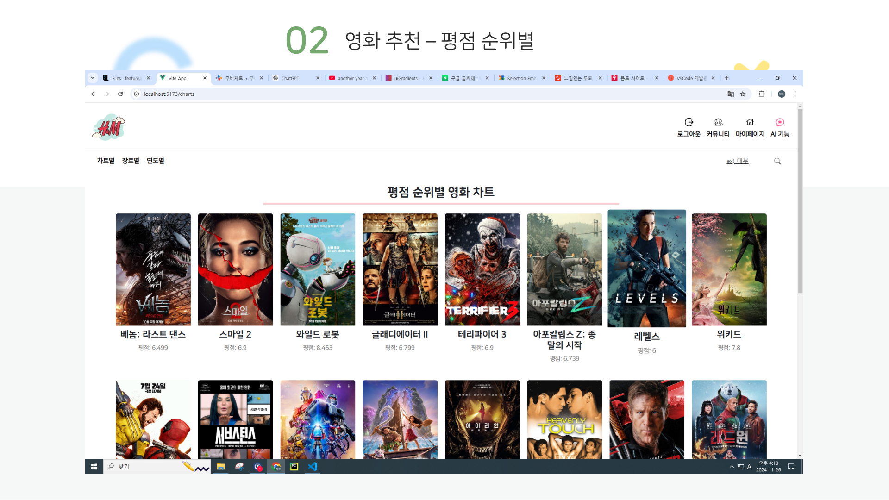
### 장르별
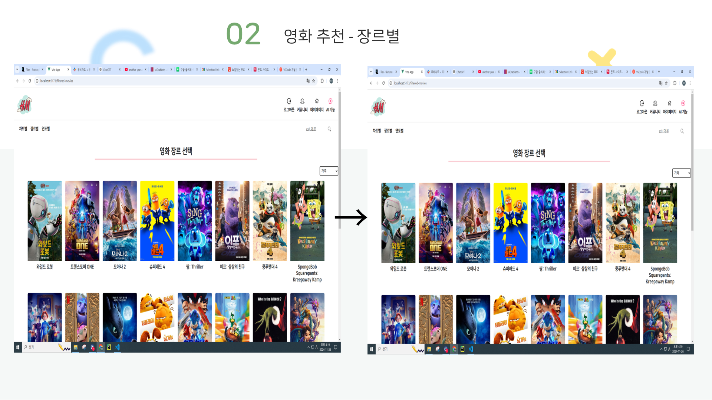
### 연도별
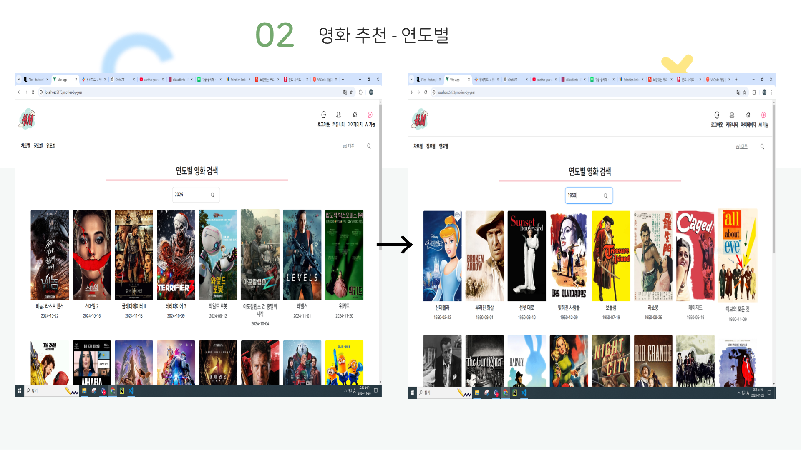
## 영화 세부 화면
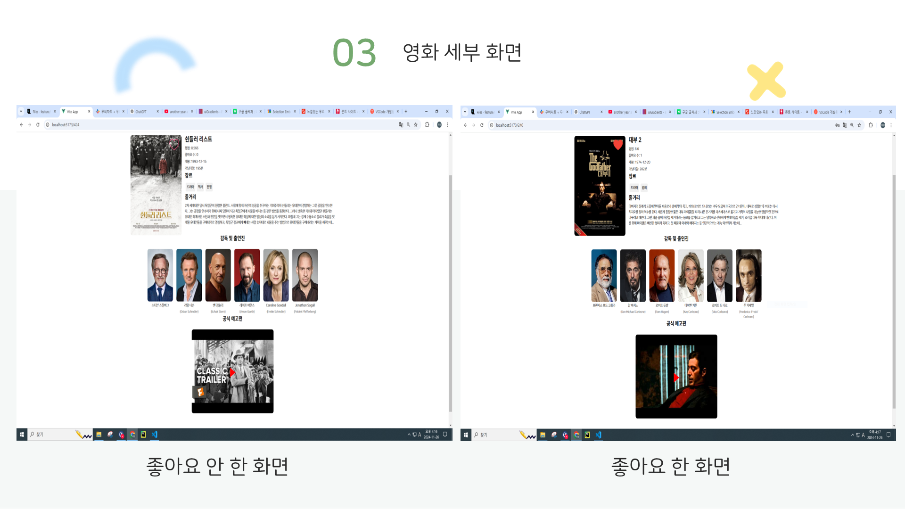
## 영화 검색 기능
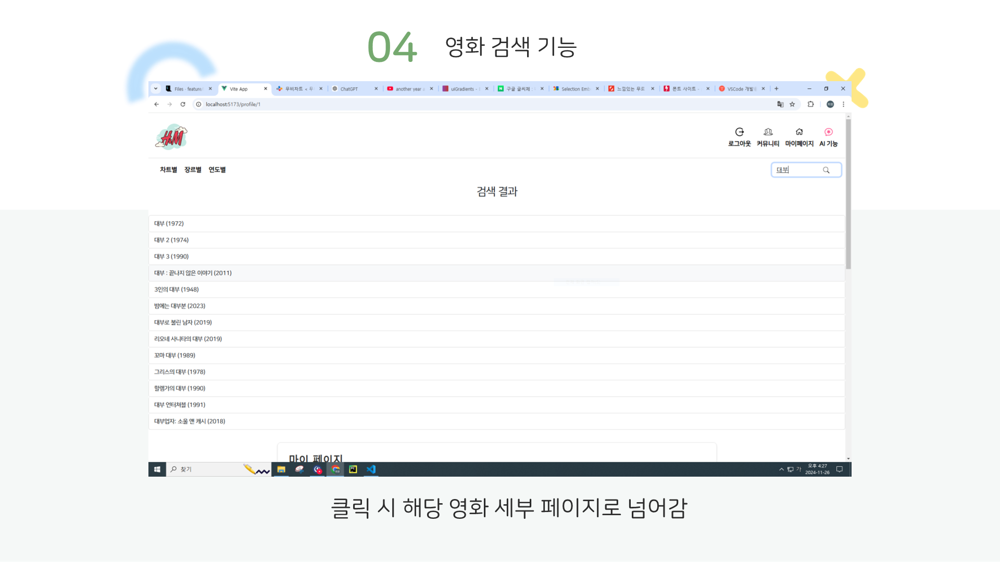
## AI 챗 기능
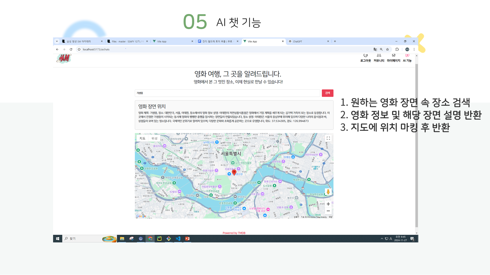
## 회원가입
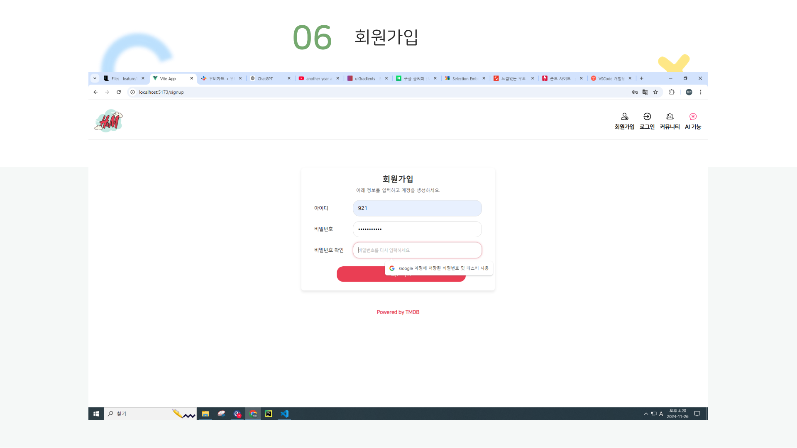
## 로그인
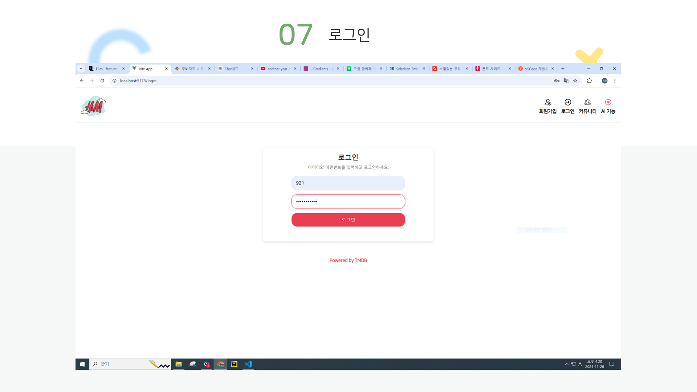
## 마이페이지
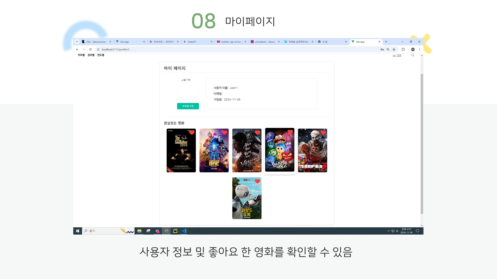
## 커뮤니티 메인페이지
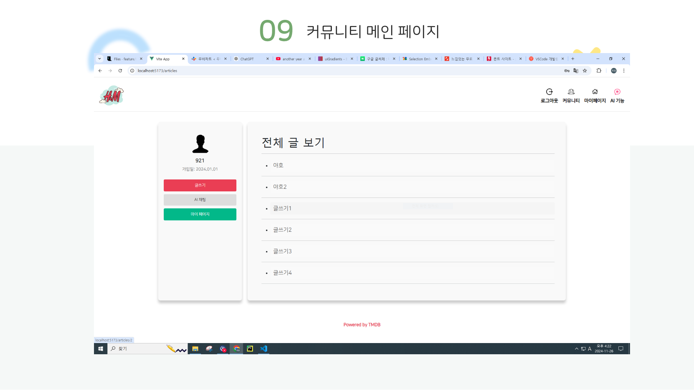
## 글쓰기 기능

## 글 수정
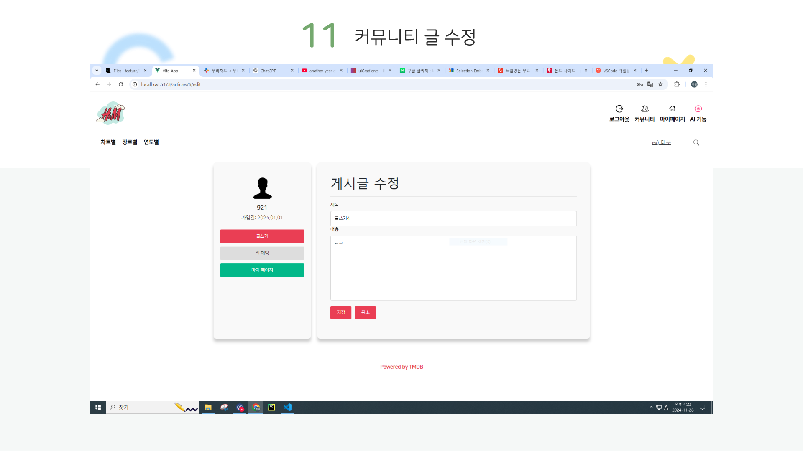
## 글 삭제
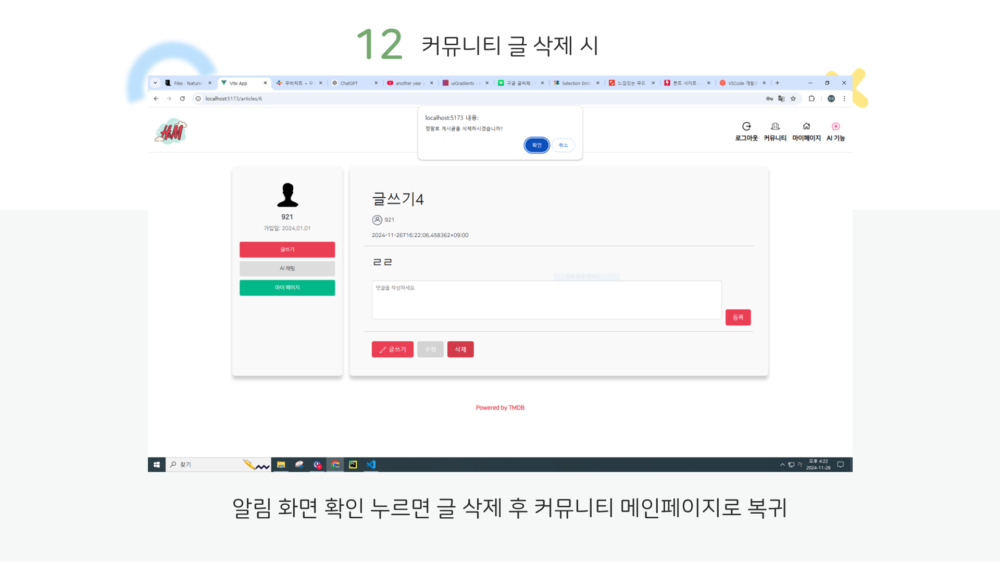